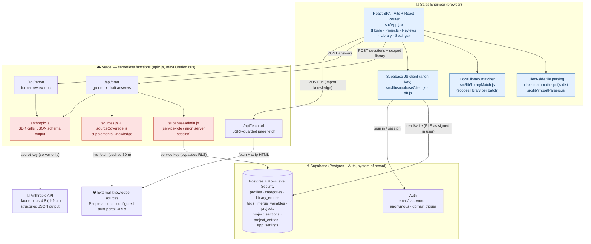
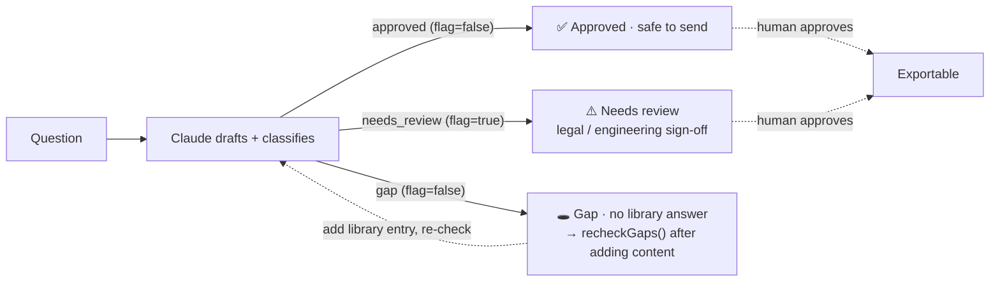
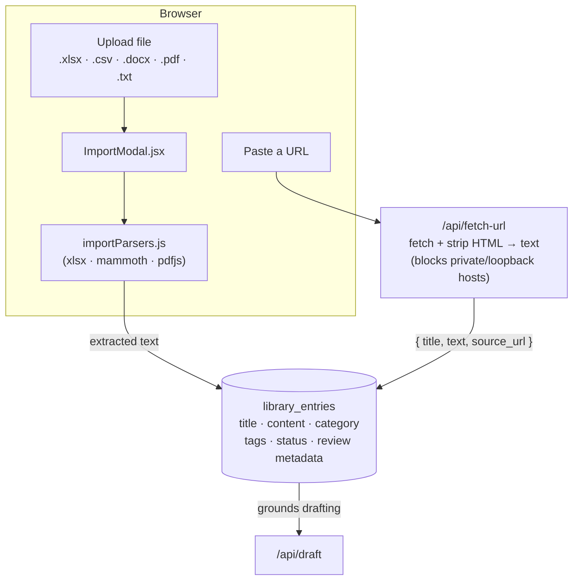
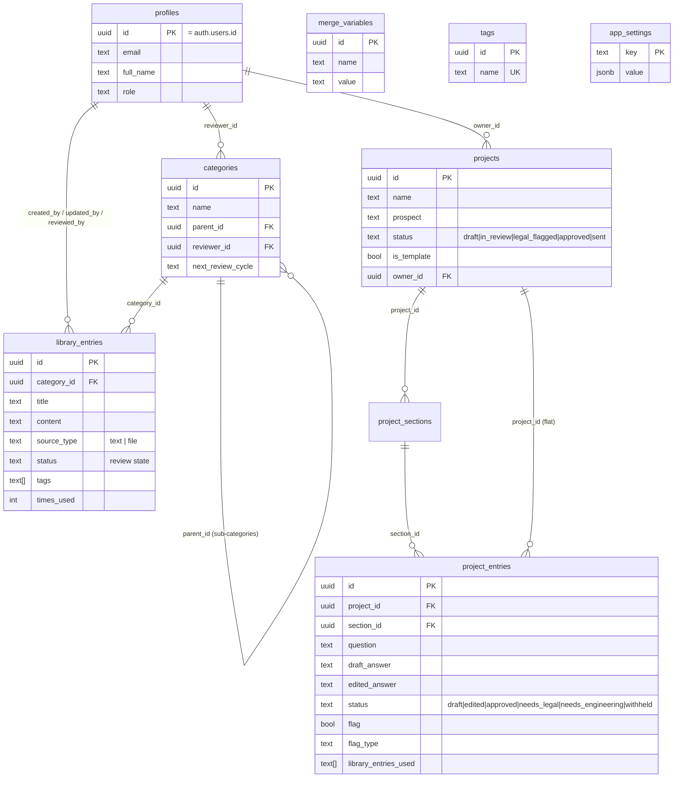
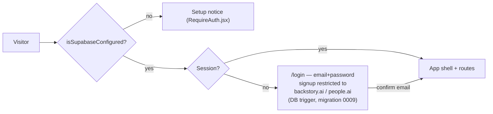

# MAX: Machine Answer Expert — Architecture & Data Flow

Diagrams are [Mermaid](https://mermaid.js.org/); they render natively on GitHub and in the
VS Code Mermaid preview. Source of truth for behavior is the code — see file references inline.

---

## 1. System architecture (components & trust boundaries)

The browser only ever holds the **public Supabase anon key** (RLS-protected). Secret keys —
`ANTHROPIC_API_KEY` and the Supabase service-role key — live only in the Vercel serverless
runtime and are never bundled to the client.



**Trust boundary:** everything in the *browser* box runs with the public anon key under RLS.
Everything in the *Vercel* box runs with secrets and is the only tier that talks to Anthropic or
holds the service-role key. The browser never sees `ANTHROPIC_API_KEY`.

---

## 2. Core data flow — drafting a questionnaire

End-to-end path from importing a questionnaire to a reviewed, exportable answer set. The client
batches the questionnaire (`DRAFT_BATCH_SIZE = 6`, `DRAFT_CONCURRENCY = 6`) so it stays under the
server's `MAX_QUESTIONS_PER_REQUEST = 10` and the 60s function limit. See
[src/pages/projects/Project.jsx](../src/pages/projects/Project.jsx) and
[api/draft.js](../api/draft.js).

```mermaid
sequenceDiagram
    autonumber
    actor SE as Sales Engineer
    participant UI as React SPA
    participant SB as Supabase (RLS)
    participant API as /api/draft (Vercel)
    participant SRC as Supplemental sources
    participant CL as Anthropic (Claude)

    SE->>UI: Paste / import questionnaire
    UI->>UI: Parse questions (importParsers.js)
    UI->>SB: Read library_entries (getLibraryEntries)
    SB-->>UI: Library entries (title + content)

    loop Each batch of ≤6 questions (6 in parallel, with backoff)
        UI->>UI: Match top entries per question (libraryMatch.js) → scoped library text
        UI->>API: POST { questions, prospect, library: scoped }
        Note over API: client library preferred; else getDbLibrary(); else bundled
        API->>SRC: getSupplementalSources() (coverage + URLs, cached 30m)
        SRC-->>API: Supplemental knowledge block
        API->>CL: messages.stream(system=rules+library, json_schema, thinking OFF)
        CL-->>API: { answers[]: classification, flag, sources, ... }
        API-->>UI: answers[]
    end

    UI->>SB: Insert/update project_entries (draft_answer, status, flags)
    SB-->>UI: Saved rows
    UI-->>SE: Render cards bucketed: Approved · Needs review · Gaps

    SE->>UI: Edit / approve / flag answers
    UI->>SB: updateProjectEntry(...)
    SE->>UI: Export → POST /api/report → formatted review draft
```

**Grounding precedence inside `/api/draft`** (api/draft.js:40):
`clientLibrary` (what the signed-in browser already read) → `getDbLibrary()` (server reads Supabase
with the service-role/anon session) → bundled `FALLBACK_LIBRARY`. Supplemental sources are
**always appended**.

**Answer classification** (api/_lib/anthropic.js, rule 9) maps to the project-entry status buckets:



---

## 3. Knowledge ingestion (building the Library)

Two ways content enters `library_entries`: client-parsed file uploads, and server-fetched URLs
(the browser can't fetch arbitrary pages due to CORS, and the fetch is SSRF-guarded server-side).



---

## 4. Data model (relationships)

Postgres on Supabase; full DDL in [supabase/migrations/0001_init.sql](../supabase/migrations/0001_init.sql).
Every content table has RLS enabled with a broad shared-workspace policy (any authenticated/anonymous
session may read/write). See [docs/DATA_MODEL.md](DATA_MODEL.md).



**Two answer stores, one promotion path:** reusable approved answers live in `library_entries`;
per-questionnaire answers live in `project_entries` (exportable only when `status = 'approved'`).
A project answer becomes reusable library source **only when a reviewer promotes it** into
`library_entries` — the AI draft is an input to review, never automatically authoritative.

---

## 5. Auth & access



> **Note:** RLS is currently a permissive shared-workspace policy and anonymous sessions are
> enabled, so production access should be gated at the hosting layer (e.g. Vercel Deployment
> Protection) until role-based Supabase policies are introduced.
